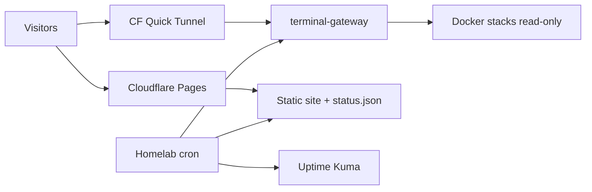

# homelab-configs

Reference configs and automation for my **bare-metal homelab portfolio**.

[](https://christopher.isageek.net)
[](https://www.linkedin.com/in/christopher-maldonado-86317228b/)

> Sanitized for public sharing — no secrets, tokens, or live credentials.

---

## Why this repo exists

The [portfolio site](https://christopher.isageek.net) shows **live** status, architecture, and a read-only terminal. This repo is the proof behind it: how the stack is wired, how status syncs to Cloudflare Pages, and how the public terminal is locked down.

For **sysadmin / infrastructure** hiring, it answers: *Can this person document, automate, and ship safely — not just install Docker once?*

---

## Architecture (high level)



| Layer | What it does |
|--------|----------------|
| **Cloudflare Pages** | Static portfolio, `status.json`, Pages Functions |
| **Homelab cron** | `fetch_status.py` → Uptime Kuma + host CPU/RAM/disk → deploy if changed |
| **Quick tunnel** | Outbound WebSocket to read-only terminal (no inbound ports) |
| **Caddy** | Reverse proxy, TLS via DNS-01 |
| **Docker** | AdGuard, monitoring, apps, terminal gateway |

---

## Repository layout

| Path | Description |
|------|-------------|
| [`terminal-gateway/`](terminal-gateway/) | Read-only WebSocket shell — path jail, redaction, audit log |
| [`scripts/fetch_status.py`](scripts/fetch_status.py) | Builds live `status.json` from Uptime Kuma + `/proc` metrics |
| [`scripts/sync_site.sh`](scripts/sync_site.sh) | Cron-friendly sync to Cloudflare Pages |
| [`caddy/Caddyfile.example`](caddy/Caddyfile.example) | Reverse proxy + DNS-01 TLS pattern |
| [`site/ws-config.example.json`](site/ws-config.example.json) | Cloudflare tunnel WebSocket URL template |

---

## Security model (summary)

- **No inbound ports** on the home network for public services
- **Secrets outside deploy paths** (e.g. `.cf.env` never in `site/`)
- **Terminal gateway:** read-only rootfs, non-root user, `cap_drop: ALL`, blocked sensitive paths, output redaction, audit log
- **TLS:** Caddy + Let's Encrypt DNS-01

See [SECURITY.md](SECURITY.md) for reporting and scope.

---

## Quick start (adapt for your lab)

**Requirements:** Linux, Docker, Cloudflare account (Pages + optional Tunnel), Uptime Kuma on localhost.

```bash
# 1. Terminal stack (read-only public shell)
cd terminal-gateway
docker compose --profile quick-tunnel up -d --build

# 2. Status sync (on homelab host)
# Edit paths in scripts/fetch_status.py, then:
sudo python3 scripts/fetch_status.py
# Wire scripts/sync_site.sh into cron for Pages deploy
```

Replace example domains in `caddy/Caddyfile.example` and tunnel URL in `site/ws-config.example.json`.

---

## Hardware context

Dell OptiPlex 780 (Core 2 Duo, 16 GB RAM) running 12+ containers — constraint-driven homelab, not a datacenter flex.

---

## Author

**Christopher Maldonado** — infrastructure support → sysadmin path  
Portfolio: [christopher.isageek.net](https://christopher.isageek.net) · [LinkedIn](https://www.linkedin.com/in/christopher-maldonado-86317228b/)

---

## License

[MIT](LICENSE) — use freely, no warranty.
