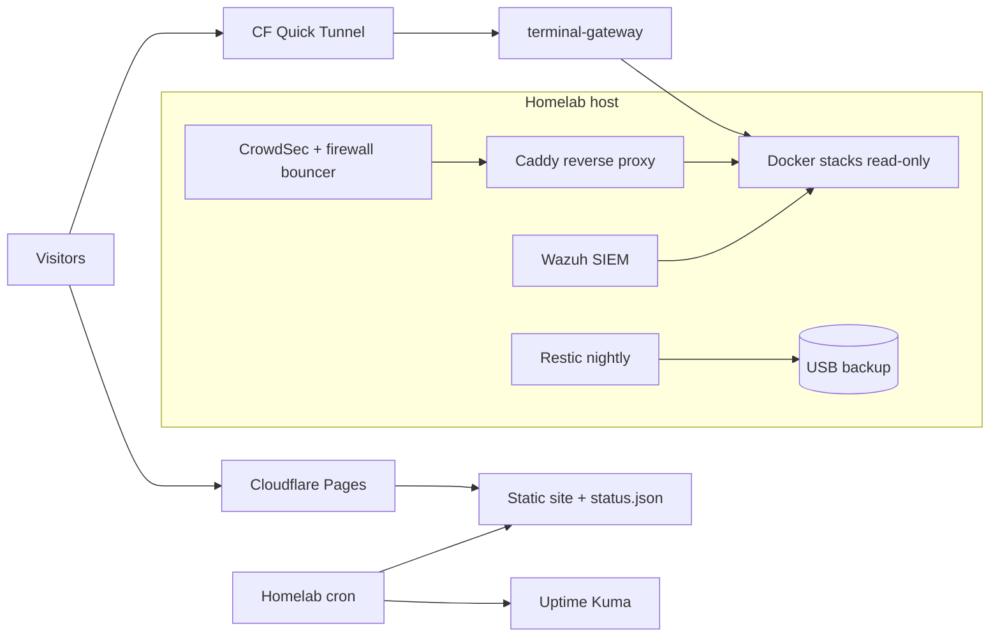

# homelab-configs

Reference configs and automation for my **bare-metal homelab portfolio**.

[](https://christopher.isageek.net)
[](https://www.linkedin.com/in/christopher-maldonado-86317228b/)

> Sanitized for public sharing — no secrets, tokens, or live credentials. Domains are shown as `example.com` and private IPs as placeholders.

---

## Why this repo exists

The [portfolio site](https://christopher.isageek.net) shows **live** status, architecture, and a read-only terminal. This repo is the proof behind it: how ~20 Docker stacks are wired, how status syncs to Cloudflare Pages, how the public terminal is locked down, and how the box defends and backs itself up.

For **sysadmin / infrastructure / security** hiring, it answers: *Can this person document, automate, secure, and ship safely — not just install Docker once?*

---

## Architecture (high level)



| Layer | What it does |
|--------|----------------|
| **Cloudflare Pages** | Static portfolio, `status.json`, Pages Functions |
| **Homelab cron** | `fetch_status.py` → Uptime Kuma + host CPU/RAM/disk → deploy if changed |
| **Quick tunnel** | Outbound WebSocket to read-only terminal (no inbound ports) |
| **Caddy** | Reverse proxy, TLS via DNS-01, per-service HTTPS |
| **CrowdSec** | Reads Caddy + SSH logs, bans malicious IPs via host firewall bouncer |
| **Wazuh** | Single-node SIEM (indexer + manager + dashboard) with host & Windows agents |
| **Restic** | Nightly encrypted backups of configs + DB dumps to USB |
| **Docker** | DNS, monitoring, apps, private cloud, terminal gateway |

---

## Services / stacks

| Stack | Purpose |
|-------|---------|
| **AdGuard Home + Unbound** | Network-wide DNS blocking + recursive resolver (DoH/DoT/DoQ) |
| **Caddy** | Reverse proxy + automatic TLS (Let's Encrypt DNS-01) |
| **CrowdSec** | Intrusion detection + automatic firewall bans |
| **Wazuh** | SIEM / security monitoring (host + Windows agent) |
| **Nextcloud** | Self-hosted personal file sync & share (Postgres backend) |
| **Paperless-ngx** | Document OCR + archive, email ingest |
| **SearXNG** | Private meta search engine |
| **Uptime Kuma** | Uptime probes + public status page |
| **Beszel** | Lightweight host/container metrics |
| **Dozzle** | Live container log viewer |
| **ntfy** | Self-hosted push notifications (phone alerts) |
| **Homepage** | LAN start-page dashboard for every stack |
| **terminal-gateway** | Read-only public WebSocket shell (path jail + redaction) |
| **Restic** | Encrypted nightly backups to USB |

---

## Repository layout

| Path | Description |
|------|-------------|
| [`stacks/`](stacks/) | Sanitized `docker-compose.yml` for each stack |
| [`stacks/core/`](stacks/core/) | AdGuard, Homepage, Uptime Kuma, Dozzle, Beszel |
| [`stacks/crowdsec/`](stacks/crowdsec/) | CrowdSec IDS + log acquisition |
| [`stacks/nextcloud/`](stacks/nextcloud/) | Nextcloud + Postgres |
| [`stacks/paperless/`](stacks/paperless/) | Paperless-ngx + Postgres + Redis + Tika/Gotenberg |
| [`stacks/wazuh/`](stacks/wazuh/) | Wazuh single-node resource + port overrides |
| [`stacks/lite/`](stacks/lite/) | Unbound recursive DNS |
| [`stacks/searxng/`](stacks/searxng/) | SearXNG |
| [`stacks/ntfy/`](stacks/ntfy/) | ntfy push server |
| [`caddy/Caddyfile.example`](caddy/Caddyfile.example) | Reverse proxy + DNS-01 TLS + static status pages |
| [`homepage/`](homepage/) | Homepage dashboard config (services/settings/widgets) |
| [`scripts/fetch_status.py`](scripts/fetch_status.py) | Builds live `status.json` from Uptime Kuma + `/proc` metrics |
| [`scripts/sync_site.sh`](scripts/sync_site.sh) | Cron-friendly sync to Cloudflare Pages |
| [`scripts/restic-backup.sh`](scripts/restic-backup.sh) | Nightly encrypted backup to USB (configs + DB dumps) |
| [`scripts/autostart-all.sh`](scripts/autostart-all.sh) | Boot-time bring-up of every stack in order |
| [`scripts/status-pages/refresh.sh`](scripts/status-pages/refresh.sh) | Generates static status pages for Caddy & CrowdSec |
| [`terminal-gateway/`](terminal-gateway/) | Read-only WebSocket shell — path jail, redaction, audit log |

---

## Security model (summary)

- **No inbound ports** on the home network for public services
- **CrowdSec** parses Caddy + SSH logs and bans malicious IPs at the host firewall
- **Wazuh** SIEM watches host + Windows endpoint (agent) for security events
- **Secrets outside deploy paths** (e.g. `.cf.env` never in `site/`; `.env`/`.secrets` git-ignored)
- **Terminal gateway:** read-only rootfs, non-root user, `cap_drop: ALL`, blocked sensitive paths, output redaction, audit log
- **TLS:** Caddy + Let's Encrypt DNS-01
- **Backups:** Restic encrypted repo on USB, 7 daily / 4 weekly / 2 monthly retention

See [SECURITY.md](SECURITY.md) for reporting and scope.

---

## Quick start (adapt for your lab)

**Requirements:** Linux, Docker, Cloudflare account (Pages + optional Tunnel), Uptime Kuma on localhost.

```bash
# 1. Core stack (DNS, dashboard, monitoring)
cd stacks/core && docker compose up -d

# 2. Reverse proxy (edit caddy/Caddyfile.example first)
cd stacks/proxy && docker compose up -d

# 3. Security stack
cd stacks/crowdsec && docker compose up -d

# 4. Terminal stack (read-only public shell)
cd terminal-gateway && docker compose --profile quick-tunnel up -d --build

# 5. Status sync (on homelab host)
sudo python3 scripts/fetch_status.py
# Wire scripts/sync_site.sh into cron for Pages deploy
```

Replace example domains in `caddy/Caddyfile.example`, LAN IPs in `homepage/`, and secret placeholders (`${...}`) with values from a host-local env file.

---

## Hardware context

Dell OptiPlex 5040 SFF — Intel Core i7-6700 (4C/8T), 32 GB RAM, 512 GB SSD + 16 GB USB backup, Ubuntu 26.04 LTS. Runs ~25 containers across ~15 stacks alongside a modded Minecraft server — constraint-driven homelab with per-service memory caps, not a datacenter flex.

---

## Author

**Christopher Maldonado** — infrastructure support → sysadmin path
Portfolio: [christopher.isageek.net](https://christopher.isageek.net) · [LinkedIn](https://www.linkedin.com/in/christopher-maldonado-86317228b/)

---

## License

[MIT](LICENSE) — use freely, no warranty.
